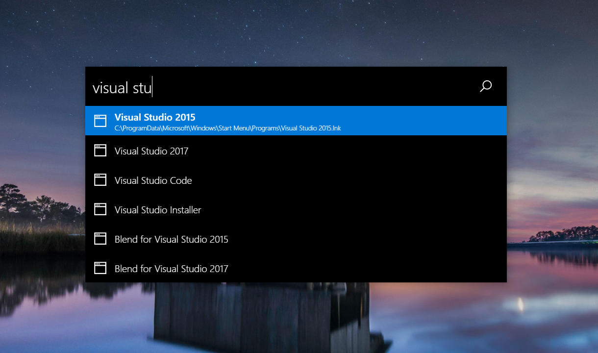

# ueli

This is an alt+space launcher for Windows and macOS.



## Installation

### Installer / Zip

> Note: because the executables are not signed Windows will probably prevent you from executing the installer or the program itself. You can click "Run anyway" to install/run the program.

* Download the latest version [here](https://github.com/oliverschwendener/ueli/releases)
* Run the installer or unzip
* Run the application

## Quick tutorial

* Press `alt+space` to show/hide the window
* Start typing a program name
* Press Enter to launch the program

## Features

### Search

* You can search for programs, files or folders in your home folder and system settings
* Use the arrow keys to scroll up and down
* Presss Enter to open the selected program/file/setting

### Open URLs with your default web browser

* Type in a URL
* Press enter to open the URL with your default web browser

### Use web search engines

* Type in `g?{your search term}` to search something on Google
* Default web search engines:
    * `g`: Google
    * `gi`: Google Images
    * `d`: DuckDuckGo
    * `yt`: YouTube
    * `l`: Linguee

### Execute commandline tools

* Start a commandline tool with the `>` prefix
    * Example: `>ipconfig /all`
* Stop an executing commandline tool with `Ctrl+c`

> Note: you can **not** interact with the commandline tool. You only see the output.

### Browse local files

* You can browse local files by typing in a filepath
    * Example: `C:\Users` or `/Applications`
* Press `Enter` to open the file or folder
* Press `Tab` for autocompletion

### Calculator

* Calculate simple math, matrix, symbolic function, convert unit and a lot more.
   * Example: 
      * `23 * 24 / 2 + (6 * 7) ^ 2`
      * `1 km/h to mile/h`
      * `a = [1, 2, 3]; a * 2`

### Keyboard shortcuts

* `Ctrl+o` to open the selected program or file at it's location
* `ArrowUp` to scroll up
* `ArrowDown`to scroll down
* `F6` or `Ctrl+l` to set focus on user input
* `F1` to get help

### Updater

To check if a new version is available right click on the tray icon. The first item in the context menu shows you if there is an update available or if you are running the latest version. If there is an update available click on "Download and install update".

## Customization

All settings are stored in `~/ueli.config.json`. You can modify this file to change the default values.

### Options

* `applicationFolders` Array of string - Represents the folders which are scanned for applications.
* `autoStartApp` Boolean - If the app should be started automatically when user logs in.
* `colorTheme` String - Defines the color theme. Available color themes: `dark`, `light`.
* `maxSearchResultCount` Number - Maximum number of search results to be displayed.
* `rescanInterval` Number - Interval in seconds to rescan for installed programs.
* `searchOperatingSystemSettings` Boolean - If operting system settings should appear in the search results. (Works only on Windows at the moment)
* `searchResultExecutionArgumentFontSize` Number - Represents the font size of the search result execution argument in pixels
* `searchResultHeight` Number - Represents the height of a search result box in pixels
* `searchResultNameFontSize` Number - Represents the font size of the search result name in pixels
* `userInputFontSize` Number - Represents the font size of the user input in pixels
* `userInputHeight` Number - Represents the height of the user input box in pixels
* `webSearches` Array of webSearch Objects - A list of web search engines
    * `webSearch` Object - Defines a web search engine
        * `icon` String - Represents the svg icon for the specific web search engine
        * `name` String - Represents the name of the web search engine
        * `prefix` String - Represents the prefix for your web search engine. For example if the prefix is `g` you can type in `g?{your search term}` to search
        * `url` String - Represents the url for the search engine to which the search term is appended to. For example `https://google.com/search?q=`
* `windowWith`: Number - Represents the width of the main window in pixels

## Build status

|Platform|Build status|
|---|---|
|Windows|[](https://ci.appveyor.com/project/oliverschwendener/ueli)|
|macOS||

## Code coverage

[](https://coveralls.io/github/oliverschwendener/ueli?branch=master)

## Roadmap

* List frequently executed programs/files/settings higher
* Add more color themes
* Add option to add custom shortcuts
* Add input history browsing
* Add nice GUI to modifiy configuration
* Notify user when update is available
* Use vue components

## Development

### Requirements

* Git
* Node.js
* Yarn

### Setup

```
$ git clone https://github.com/oliverschwendener/ueli
$ cd ueli
$ yarn
```

### Run

```
$ yarn build
$ yarn start
```

> Note: there is also a watch task `$ yarn build:watch` which watches the stylesheets and typescript files and transpiles them automatically if there are any changes.

### Debug

> Note: for debugging you need Visual Studio Code

Choose one of these debug configurations:


### Run tests

```
$ yarn test:unit
$ yarn test:integration
```

### Code coverage

```
$ yarn test:unit --coverage
```

### Package

```
$ yarn package
```

## Alternatives

* [Launchy](https://www.launchy.net/)
* [Wox](https://github.com/Wox-launcher/Wox)
* [Alfred](https://www.alfredapp.com/)
* [Hain](https://github.com/hainproject/hain)
* [Zazu App](http://zazuapp.org/)
* [Cerebro](https://cerebroapp.com/)

## License

Copyright (c) Oliver Schwendener. All rights reserved.

Licensed under the [MIT](LICENSE) License.
